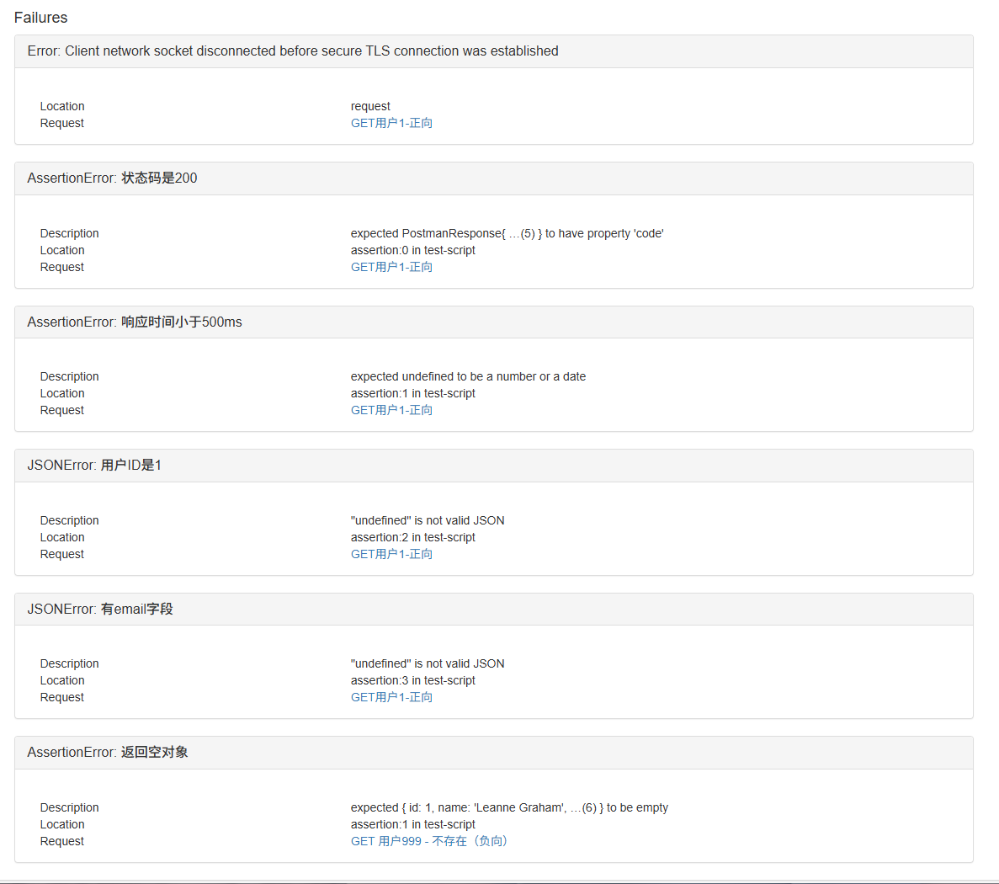
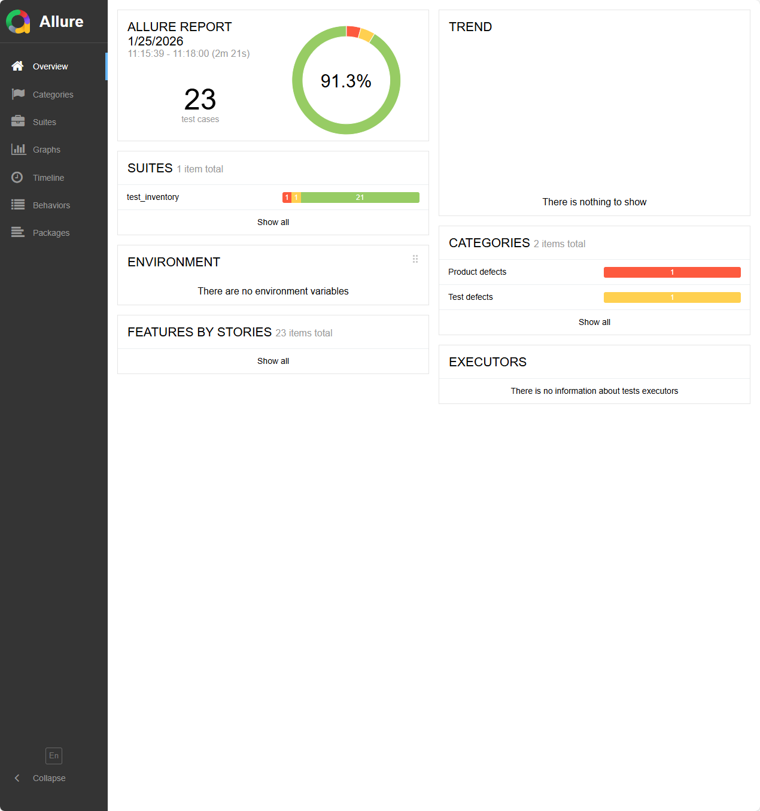
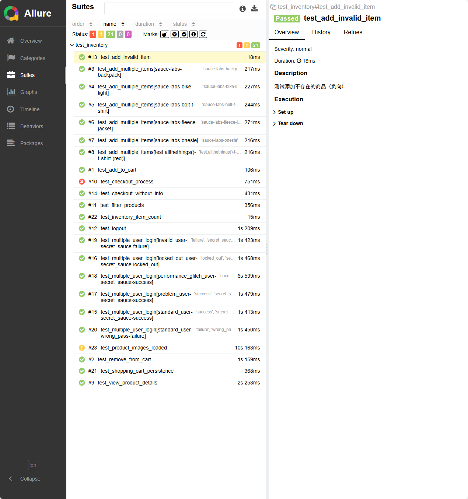
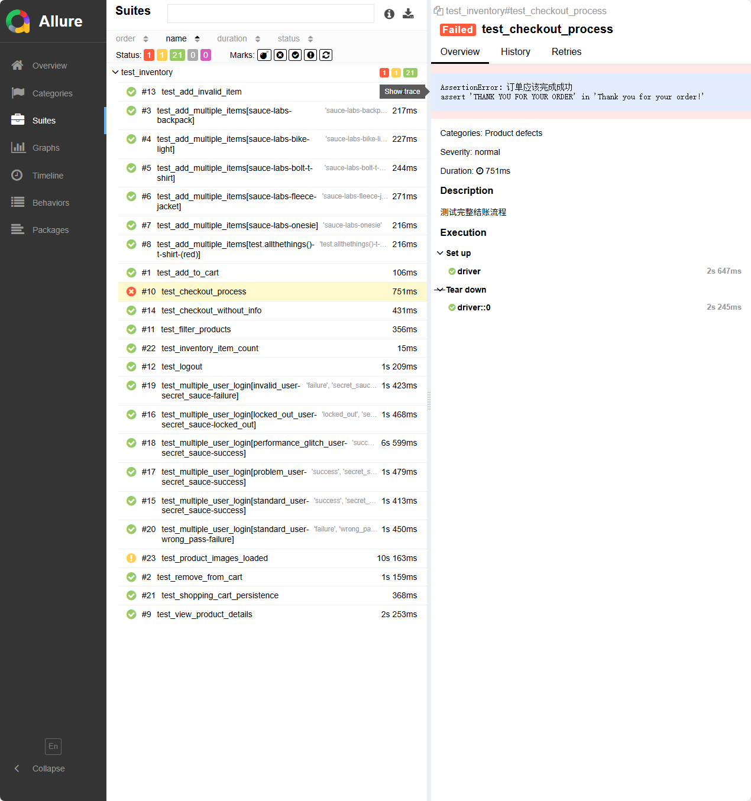

# 自动化测试平台

企业级自动化测试平台，集成 Web UI (Selenium) + REST API (Requests) 测试。

## 技术栈
- Python 3.10+
- Pytest 9.0+
- Selenium + webdriver-manager
- Requests
- allure-pytest

## 运行方式
1. 激活虚拟环境
.venv\Scripts\activate
2. 安装依赖
pip install -r requirements.txt
3. 运行测试并生成报告数据
pytest -s --alluredir=allure-results
4. 查看Allure报告（浏览器自动打开）
allure serve allure-results
## Allure报告示例
100% 通过率，4个用例，执行时间约6秒


完整静态报告：运行 `allure generate allure-results -o reports --clean` 生成后，用本地服务器查看（cd reports && python -m http.server 8000）
## Postman + Newman 接口自动化报告示例

使用Newman命令行自动化执行Postman集合，生成HTML报告。

总体统计：15个断言，平均响应时间223ms，通过率约60%（负向用例用于验证API边界行为）。




完整报告文件：reports/report.html（双击打开查看每个请求详情、通过/失败、响应时间）。
## 项目升级成果）
- UI 用例扩充到15+（登录、购物车、结账、多用户登录、筛选、登出、负向校验等）
- API 用例扩充到30+（批量CRUD、参数化、负向参数非法/资源不存在）
- 重构为 POM 模式（页面对象模型），代码更规范、可维护
- 添加 pytest 参数化（多数据测试）、失败截图 + Allure.attach 日志
- Runner 批量运行：23 个用例，通过率 91.3%（失败用例用于验证边界行为）

### Allure 报告示例




(xm_E2.png)
命令行运行方式：
```bash
newman run "api_collection.json" -r html --reporter-html-export report.html。

欢迎 Star & Fork！
