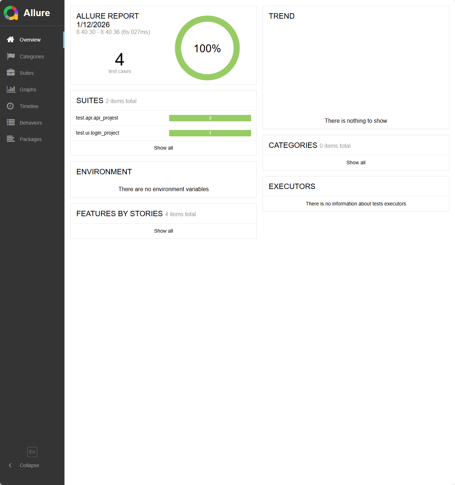
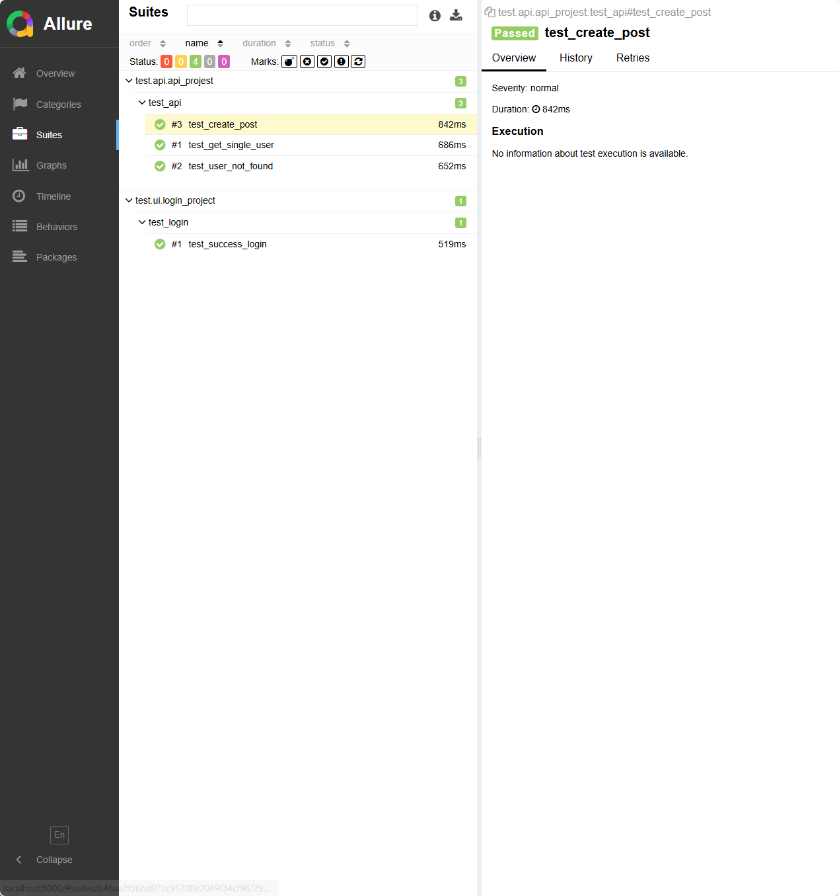
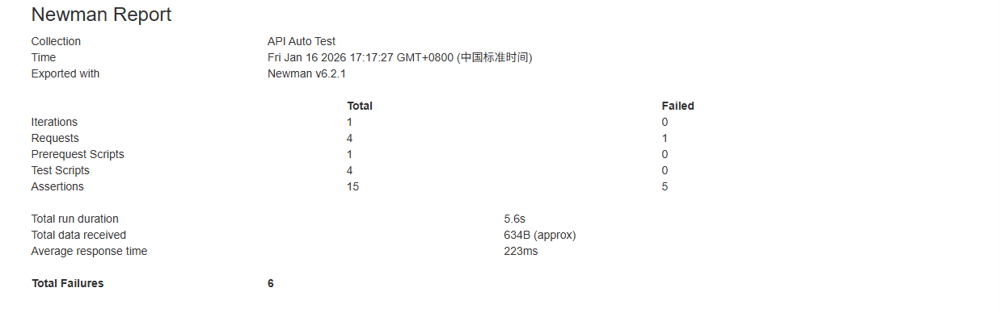
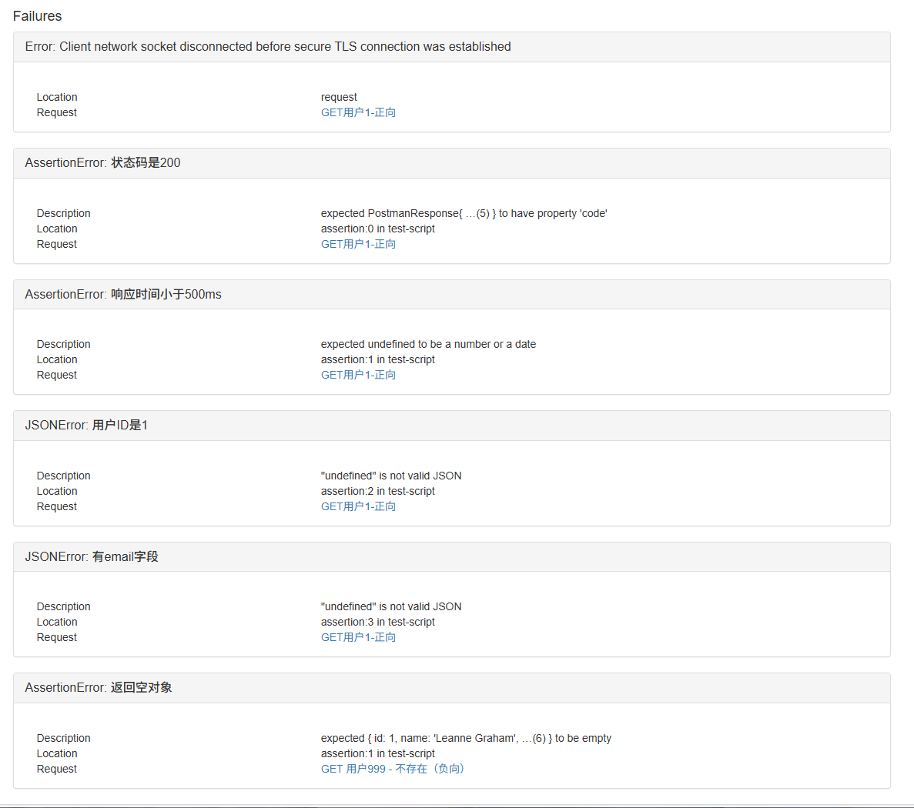
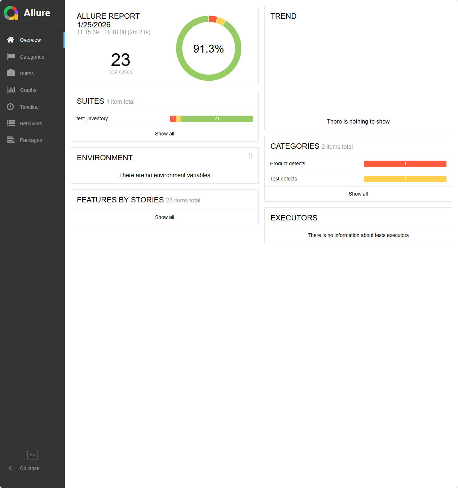
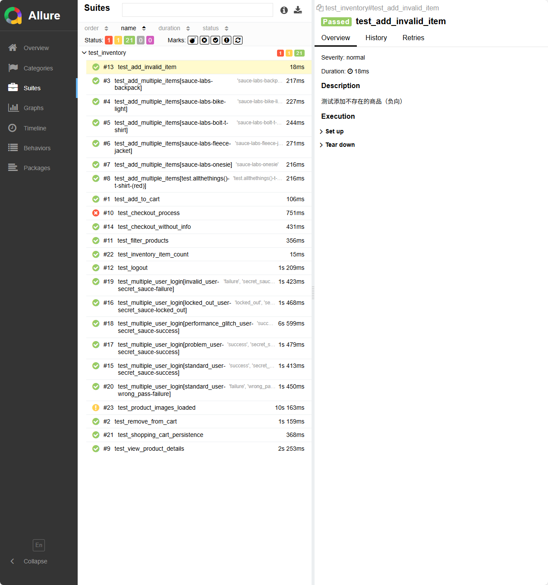
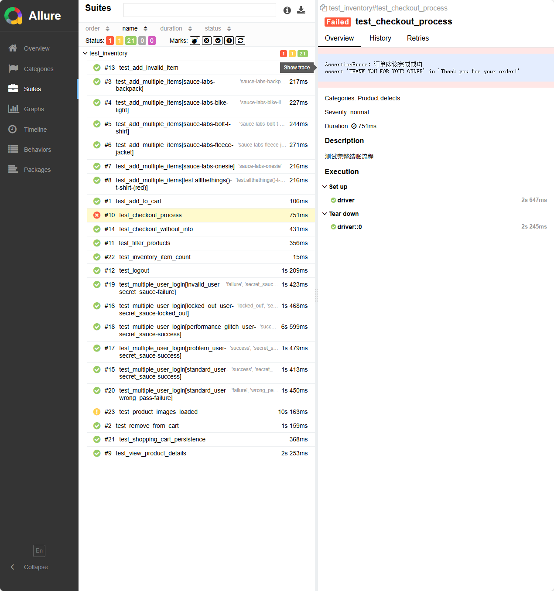
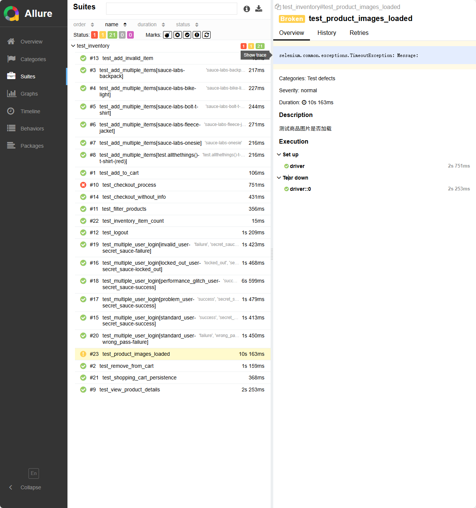
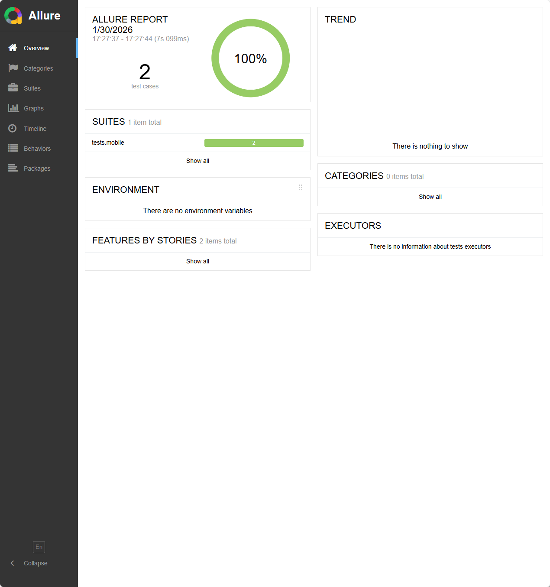

# 全栈自动化测试平台（Web UI + REST API + Mobile App）

企业级自动化测试框架，集成 Selenium、Requests、Appium，支持 Web、API、移动端多端测试。

## 技术栈
- Python 3.10+
- Pytest 9.0+（用例管理、fixture、断言、参数化）
- Selenium + webdriver-manager（Web UI 自动化）
- Requests（REST API 测试）
- Appium + Appium-Python-Client（Android App UI 自动化）
- Postman + Newman（接口集合 + 命令行自动化）
- allure-pytest（可视化报告生成）
- GitHub（版本控制、公开展示）

## 运行方式
1. 激活虚拟环境
.venv\Scripts\activate
2. 安装依赖
pip install -r requirements.txt
3. 运行测试并生成报告数据
pytest -s --alluredir=allure-results
4. 查看Allure报告（浏览器自动打开）
allure serve allure-results
## Allure报告示例
100% 通过率，4个用例，执行时间约6秒





完整静态报告：运行 `allure generate allure-results -o reports --clean` 生成后，用本地服务器查看（cd reports && python -m http.server 8000）
## Postman + Newman 接口自动化报告示例

使用Newman命令行自动化执行Postman集合，生成HTML报告。

总体统计：15个断言，平均响应时间223ms，通过率约60%（负向用例用于验证API边界行为）。





完整报告文件：reports/report.html（双击打开查看每个请求详情、通过/失败、响应时间）。
## 项目升级成果）
- UI 用例扩充到15+（登录、购物车、结账、多用户登录、筛选、登出、负向校验等）
- API 用例扩充到30+（批量CRUD、参数化、负向参数非法/资源不存在）
- 重构为 POM 模式（页面对象模型），代码更规范、可维护
- 添加 pytest 参数化（多数据测试）、失败截图 + Allure.attach 日志
- Runner 批量运行：23 个用例，通过率 91.3%（失败用例用于验证边界行为）

### Allure 报告示例






### 命令行运行方式（Newman）：

newman run "api_collection.json" -r html --reporter-html-export report.html

### 移动端自动化测试（Appium + Pytest + Allure）:
实现了基于 Appium 的 Android App UI 自动化测试框架，以 F-Droid 开源 App 为测试对象。

### 主要功能
- 支持 App 启动 + 首页加载验证
- 支持搜索功能测试（点击 fab_search → 输入关键词 → 验证结果列表）
- 使用 Pytest fixture 管理 Appium driver 会话
- 集成 WebDriverWait + expected_conditions 元素等待
- 失败用例自动截图并附加到 Allure 报告（conftest.py）
- Allure 可视化报告生成

### 运行方式
```bash
# 运行移动端测试
pytest -s test/mobile/test_mobile_login.py

# 生成 Allure 报告
pytest -s --alluredir=allure-results test/mobile/test_mobile_login.py
allure generate allure-results -o allure-report --clean
``` 

### 移动端 Allure 报告示例
只包含 `test_mobile_login.py` 的 2 个用例（启动验证 + 搜索验证），全通过 100%。



### 欢迎 Star & Fork！
GitHub 仓库：https://github.com/feirenzai404/automation-test-platform
